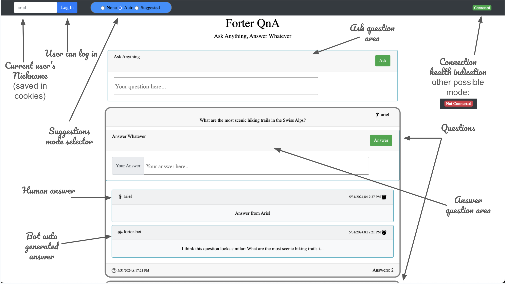
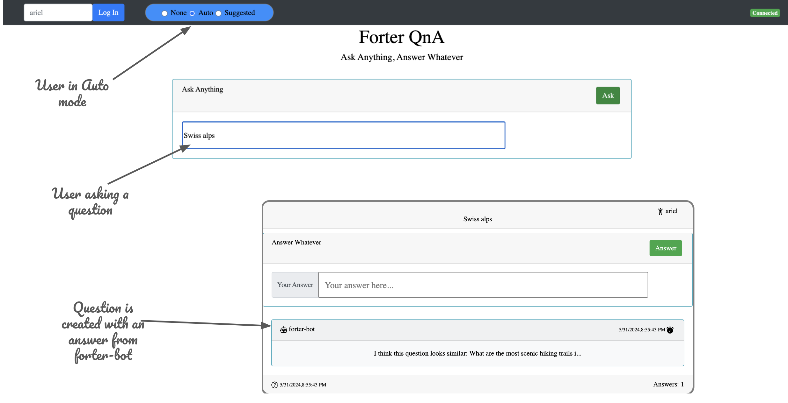

# Forter QnA - Ask Anything Answer Whatever

## Overview
In this repo I present my solution to Forter chat home assignment.

## Product


## Special feature - Suggestions mode
User can switch between three modes:
1. `None`
2. `Suggested` - once a question is typed, user gets suggestions for similar previously asked questions.
   
3. `Auto` - once a question is placed, `forter-bot` adds an answer with an indication to similar previously asked question if exists.
   

## Project

### Server

#### Environment
##### Install
``npm i``
##### Run in dev mode (nodemon watched)
``npm run dev``
##### Run in prod mode
``npm run start``
##### Run tests
``npm run test``

#### Project
Express server written in _TypeScript_
- `routes`: Contains route handlers for handling CRUD operations such as `askQuestion`, `answerQuestion` or `createUser`.
- `middleware`: Includes middleware functions, such as error handling middleware.
- `elastic`: Contains code for initializing and interacting with ElasticSearch clients.
- `types`: Contains types definitions.
- `test`: Contains test files, including `Questions.specs.ts` and `Users.specs.ts`, for testing server endpoints.

#### Data Schema Models
The central entity of the server is `question`:
````json
{
  "Question": {
    "content": "string",
    "questionMetadata": {
      "id": "string",
      "created": "number",
      "updated": "number",
      "askedBy": {
        "nickName": "string"
      }
    },
    "answers": [
      {
        "content": "string",
        "questionMetadata": {
          "id": "string",
          "created": "number",
          "updated": "number",
          "answeredBy": {
            "nickName": "string"
          }
        }
      }
    ]
  }
}

````

#### Authentication and Identification
There is no real identification integrated in this project but the replacement for that is the field `nickName` that is served as the unique identifier of a user in our environment. 

#### Error Handling
Error handling in the server is managed using middleware function called `errorHandlingMiddleware` and is covered in tests.

#### Testing
The server includes comprehensive testing for its endpoints. Test files under the `test` folder, such as `Questions.specs.ts` and `Users.specs.ts`, provide thorough testing coverage to validate the functionality of server routes, using test best practices such as _givens_ and _fixtures_.

#### ElasticSearch Integration
Elastic search offers a _pipeline_ where each document that is digested, is also going through an inference layer that 
extracts the `content` of the `question` to a list of related terms that will later be used when searching as part of `vector-search`


An example for such a list that is stored in our database for the following question:  
`How to export TypeScript types as well as other formats`:
````json
"ml": {
            "inference": {
              "content_expanded": {
                "predicted_value": {
                  "##mar": 0.022093825,
                  "##script": 0.49746236,
                  "software": 0.74255574,
                  "data": 0.17825964,
                  "iso": 0.1603348,
                  "catalog": 0.11807344,
                  "convert": 0.39258838,
                  "type": 1.5106242,
                  "output": 0.056385376,
                  "download": 0.7550621,
                  "compatible": 0.02087445,
                  "java": 0.38867038,
                  "tab": 0.49824187,
                  "create": 0.029506575,
                  "html": 0.37528616,
                  "text": 0.9785356,
                  "export": 2.0568376,
                  "##cript": 2.050864,
                  "method": 0.11275004,
                  "format": 1.4777946,
                  "batch": 0.14916897,
                  "eps": 0.16427729,
                  "archive": 0.7449079,
                  "version": 0.3436087,
                  "script": 1.2535894,
                  "tool": 0.42850184,
                  "tutor": 0.17691956,
                  "disk": 0.085540906,
                  "extract": 0.090559825,
                  "binary": 0.25368565,
                  "files": 0.41625097,
                  "fields": 0.36482808,
                  "flash": 0.12018024,
                  "other": 0.19171435,
                  "formats": 1.5406185,
                  "code": 0.29851654,
                  "import": 1.1671944,
                  "exports": 0.10782419,
                  "cad": 0.63225,
                  "document": 0.5770348,
                  "save": 0.5384392,
                  "scan": 0.2351656,
                  "manual": 0.075035654,
                  "sid": 0.07142141,
                  "button": 0.16175517,
                  "apple": 0.03622358,
                  "file": 0.9571011,
                  "cas": 0.42414042,
                  "vector": 0.21355835,
                  "sheet": 0.11264204,
                  "copy": 0.40532643,
                  "editor": 0.64502394,
                  "types": 1.6205081,
                  "mini": 0.026715472,
                  "display": 0.1292184,
                  "adobe": 0.08914066,
                  "excel": 0.7741391,
                  "cs": 0.14220314,
                  "print": 0.17971307,
                  "pdf": 0.27196732,
                  "application": 0.04083752,
                  "form": 0.0038276282,
                  "serial": 0.028617157,
                  "syntax": 0.23704037,
                  "online": 0.2224539,
                  "cod": 0.20570368,
                  "step": 0.23945299,
                  "font": 0.75295043
                },
                "model_id": ".elser_model_2_linux-x86_64"
              }
            }
          }
        }
      }
````

### Client
#### Environment
##### Install
``npm i``
##### Run (watched)
``npm run serve``

#### Project
Lit Framework project written in _JavaScript_. Also using _Bootstrap_. 
Main elements:
- `main-board.js`: Main page that contains that nav-bar, user information section, 
connected widget, questions section and ask question card. 
- `question.js`: Card that presents metadata of the question, its content and the list of its answers.
- `answer.js`: Card that presents metadata of the answer and its content.
- `answer-question-card.js`: Card with form to submit an answer.

### Communication between Client and Server
Server maintains both socket and http endpoints.
Client receives initial data as part of `new-connection` and listens for changes on `question-created` and `question-updated`.  
Other operation are done using http calls such as `create-user`, `ask-question` or `answer-question`.

## What is missing that I am aware of?
- Input validation in server side is missing (I would use a middleware for this).
- Error handling on client is totally missing.
- Client is not tested at all.
- Architecture of the client - I couldn't take use in Life Cycle function of the lit elements as I would want. For instance, 
I would want to have a dedicated element that deals with updating the userInfo instead of putting this inline inside `main-board.js`.
Problem is that I couldn't make the FW to rerender the element after such a change. After a long struggle, I decided to put it inline (among other stuff).
- TypeScript is not my language hence the not-perfect conventions, such as the use in clone methods instead of reasonable constructors and other aspects of the coding were affected as well.
- I couldn't create a Lit project using TypeScript for some reason hence using two languages in the same project.
